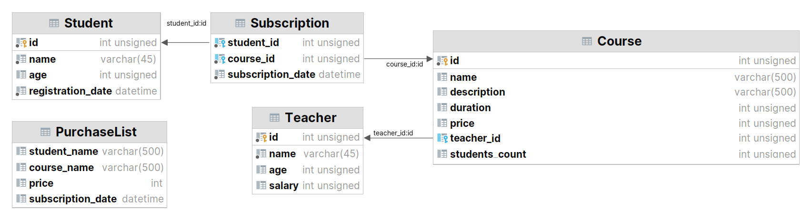

## hibernate-database

### Demonstration model of using Hibernate to create associated entities in a database automatically

***Description:***

This example demonstrates the creation of entities for a database 
by creating classes with the appropriate Hibernate annotations and relationships in tables, 
based on which tables with given fields are automatically created in the database.

***How to use:***

Create a new "database" schema in your local database (I used MySQL). 
Enter your username and password to connect to the database in the XML file hibernate.cfg.xml.
Create the "Main" class run configuration in your IDE and start the program.
After that, check your database. All the corresponding entities will be created in it.

***Tools used:***

Java  
Maven  
Hibernate  
MySQL  

